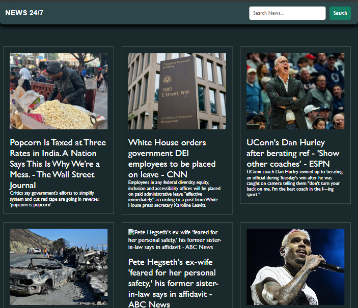
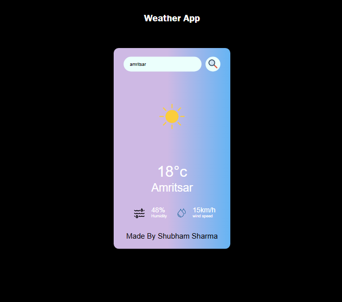
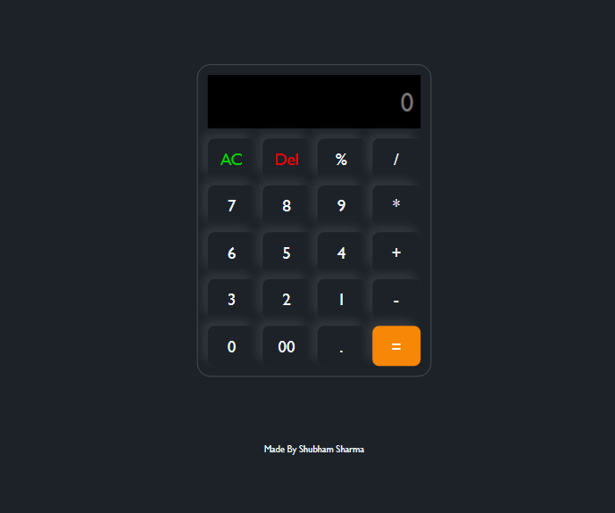
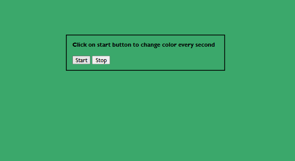
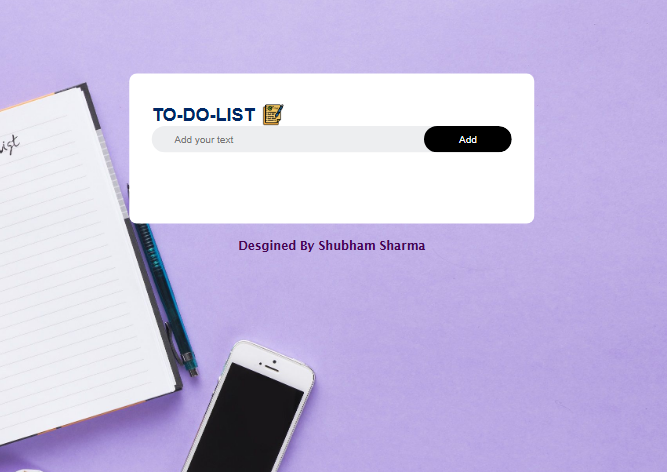

# JavaScript Projects

Welcome to the **JavaScriptProject** repository! 🚀✨ Here, you'll find a collection of fun, creative, and interactive JavaScript projects that I've built. Each project is packed with exciting features and showcases my frontend development skills. Let's dive in! 🌊

---

## Table of Contents

- [Projects](#projects)
  - [📰 News App](#-news-app)
  - [❓ Quiz App](#-quiz-app)
  - [☁️ Weather App](#-weather-app)
  - [🧮 Calculator](#-calculator)
  - [🎨 Color Changer](#-color-changer)
  - [💰 Crypto Site](#-crypto-site)
  - [🖼️ Image Slider](#-image-slider)
  - [💻 Software Solutions Clone Website](#-software-solutions-clone-website)
  - [📝 To-Do List](#-to-do-list)
- [How to Use](#how-to-use)
- [Contributing](#contributing)
- [License](#license)

---

## Projects

### 📰 News App
Stay updated with the latest news from around the world! 🌍 This app fetches news articles using an API, and you can browse them by category or search for specific topics. It's fully responsive, making it perfect for any device.

News App 
<br>




➡ **[Live Demo](https://newsappbyshubham.netlify.app/)**

### ❓ Quiz App
Test your knowledge with this interactive quiz app! 🧠💡 It features multiple-choice questions, tracks your score, and even offers feedback on your answers. Great for a quick mental workout! 💪


Quiz App
<br>


➡ **[Live Demo](https://quizgamebyshubham.netlify.app/)**

### ☁️ Weather App
Wondering if you need an umbrella today? 🌧️☀️ This weather app has got you covered! It uses an API to provide real-time weather updates based on your location or a city you search for.

Weather App 
<br>



➡ **[Live Demo](https://weatherappbyshubham.netlify.app/)**

### 🧮 Calculator
A simple yet powerful calculator that can handle all your basic arithmetic needs! ➕➖✖️➗ Designed with a clean and intuitive UI for quick calculations.

Calculator 
<br>



➡ **[Live Demo](https://calculatorbyshubham.netlify.app/)**

### 🎨 Color Changer
Feeling creative? 🎉 With this app, you can change the background color of your webpage with just a click. It's a fun way to experiment with different color schemes! 🌈

Color Changer 
<br>



➡ **[Live Demo](https://colorchangerbyshubham.netlify.app/)**

### 💰 Crypto Site
Dive into the world of cryptocurrencies! 🚀📈 This app provides real-time updates on crypto prices, market trends, and detailed stats about your favorite coins. Perfect for crypto enthusiasts! 💎

Crypto Site 
<br>


➡ **[Live Demo](https://cryptositebyshubham.netlify.app/)**

### 🖼️ Image Slider
Showcase your favorite photos with this smooth and stylish image slider! 📸✨ Navigate through images seamlessly with the provided buttons. It's a must-have for any portfolio or gallery.

Image Slider 
<br>


➡ **[Live Demo](https://imgsliderbyshubham.netlify.app/)**

### 💻 Software Solutions Clone Website
A modern, responsive clone of a software solution provider’s website built with clean UI and dynamic components. Showcases service pages, contact forms, and interactive sections — perfect for startups and tech businesses.

<br> 

➡ **[Live Demo](https://andi-softwaresolutions.netlify.app/)**

### 📝 To-Do List
Stay organized and productive with this handy to-do list app! ✅🕒 Add, delete, and manage your tasks effortlessly. It's the ultimate tool for keeping track of your day.

To-Do List 

<br>



➡ **[Live Demo](https://to-do-listbyshubham.netlify.app/)**

---

## How to Use

1. Clone the repository to your local machine:
   ```bash
   git clone https://github.com/shubhamsharma18/JavascriptProject.git
   ```
2. Navigate to the project folder:
   ```bash
   cd JavascriptProject
   ```
3. Open the individual project folder and run the `index.html` file in your browser to view the project.

---


---

## License

This repository is licensed under the MIT License. You are free to use, modify, and distribute the code as per the terms of the license.

---

## Contact Me

Have questions or feedback? Feel free to reach out! 😊

- 📧 Email: [shubhamsharma4476@gmail.com](mailto:shubhamsharma4476@gmail.com)
- 🐦 Instagram: [@shubh_2610](https://instagram.com/shubh_2610)
- 💼 LinkedIn: [Shubham](https://www.linkedin.com/in/shubham-sharma-7b92802a8/)


Thank you for checking out my projects! Feel free to explore and provide feedback. 😊
