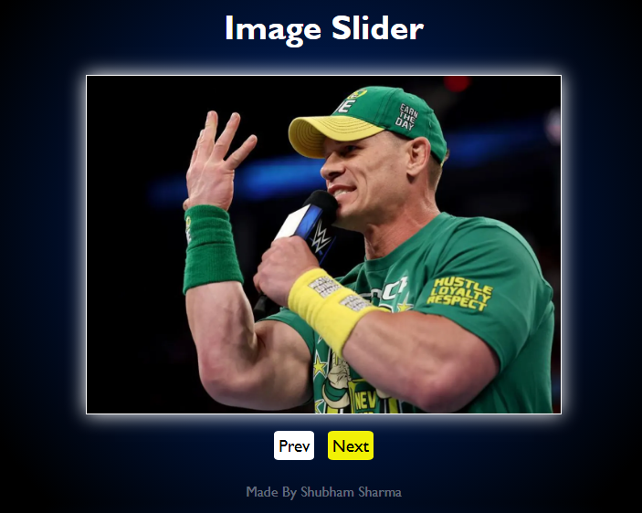

# JavaScript Projects

Welcome to the **JavaScriptProject** repository! 🚀✨ Here, you'll find a collection of fun, creative, and interactive JavaScript projects that I've built. Each project is packed with exciting features and showcases my frontend development skills. Let's dive in! 🌊

---

## Table of Contents

- [Projects](#projects)
  - [📰 News App](#-news-app)
  - [❓ Quiz App](#-quiz-app)
  - [☁️ Weather App](#-weather-app)
  - [🧮 Calculator](#-calculator)
  - [🎨 Color Changer](#-color-changer)
  - [💰 Crypto Site](#-crypto-site)
  - [🖼️ Image Slider](#-image-slider)
  - [📝 To-Do List](#-to-do-list)
- [How to Use](#how-to-use)
- [Contributing](#contributing)
- [License](#license)

---

## Projects

### 📰 News App
Stay updated with the latest news from around the world! 🌍 This app fetches news articles using an API, and you can browse them by category or search for specific topics. It's fully responsive, making it perfect for any device.


➡ **[Live Demo](#)**

### ❓ Quiz App
Test your knowledge with this interactive quiz app! 🧠💡 It features multiple-choice questions, tracks your score, and even offers feedback on your answers. Great for a quick mental workout! 💪

![Quiz App Screenshot]


➡ **[Live Demo](#)**

### ☁️ Weather App
Wondering if you need an umbrella today? 🌧️☀️ This weather app has got you covered! It uses an API to provide real-time weather updates based on your location or a city you search for.

![Weather App Screenshot]


➡ **[Live Demo](#)**

### 🧮 Calculator
A simple yet powerful calculator that can handle all your basic arithmetic needs! ➕➖✖️➗ Designed with a clean and intuitive UI for quick calculations.

![Calculator Screenshot]


➡ **[Live Demo](#)**

### 🎨 Color Changer
Feeling creative? 🎉 With this app, you can change the background color of your webpage with just a click. It's a fun way to experiment with different color schemes! 🌈

![Color Changer Screenshot]


➡ **[Live Demo](#)**

### 💰 Crypto Site
Dive into the world of cryptocurrencies! 🚀📈 This app provides real-time updates on crypto prices, market trends, and detailed stats about your favorite coins. Perfect for crypto enthusiasts! 💎

![Crypto Site Screenshot]


➡ **[Live Demo](#)**

### 🖼️ Image Slider
Showcase your favorite photos with this smooth and stylish image slider! 📸✨ Navigate through images seamlessly with the provided buttons. It's a must-have for any portfolio or gallery.

![Image Slider Screenshot]


➡ **[Live Demo](#)**

### 📝 To-Do List
Stay organized and productive with this handy to-do list app! ✅🕒 Add, delete, and manage your tasks effortlessly. It's the ultimate tool for keeping track of your day.

![To-Do List Screenshot]


➡ **[Live Demo](#)**

---

## How to Use

1. Clone the repository to your local machine:
   ```bash
   git clone https://github.com/shubhamsharma18/JavascriptProject.git
   ```
2. Navigate to the project folder:
   ```bash
   cd JavascriptProject
   ```
3. Open the individual project folder and run the `index.html` file in your browser to view the project.

---


---

## License

This repository is licensed under the MIT License. You are free to use, modify, and distribute the code as per the terms of the license.

---

## Contact Me

Have questions or feedback? Feel free to reach out! 😊

- 📧 Email: [shubhamsharma4476@gmail.com](mailto:shubhamsharma4476@gmail.com)
- 🐦 Instagram: [@shubh_2610](https://instagram.com/shubh_2610)
- 💼 LinkedIn: [Shubham](https://www.linkedin.com/in/shubham-sharma-7b92802a8/)


Thank you for checking out my projects! Feel free to explore and provide feedback. 😊
